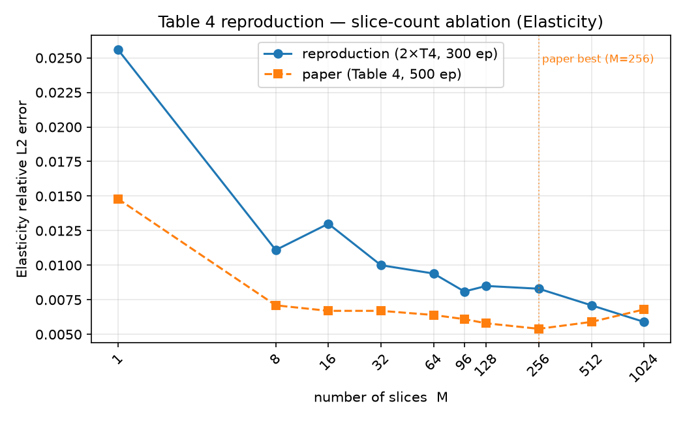
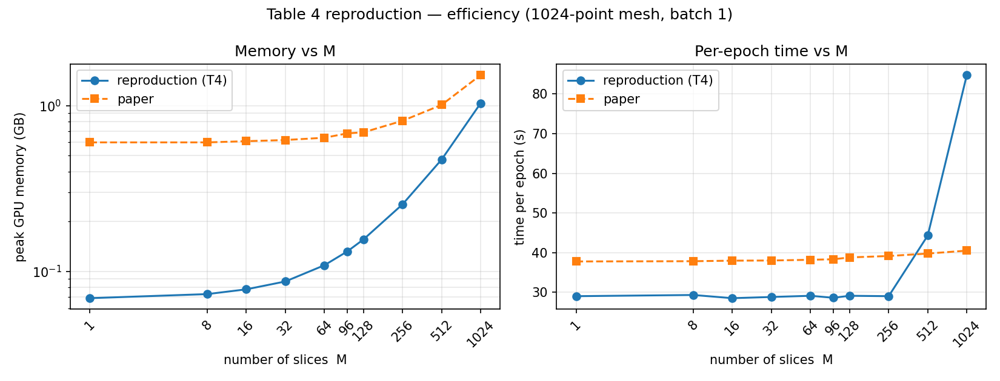
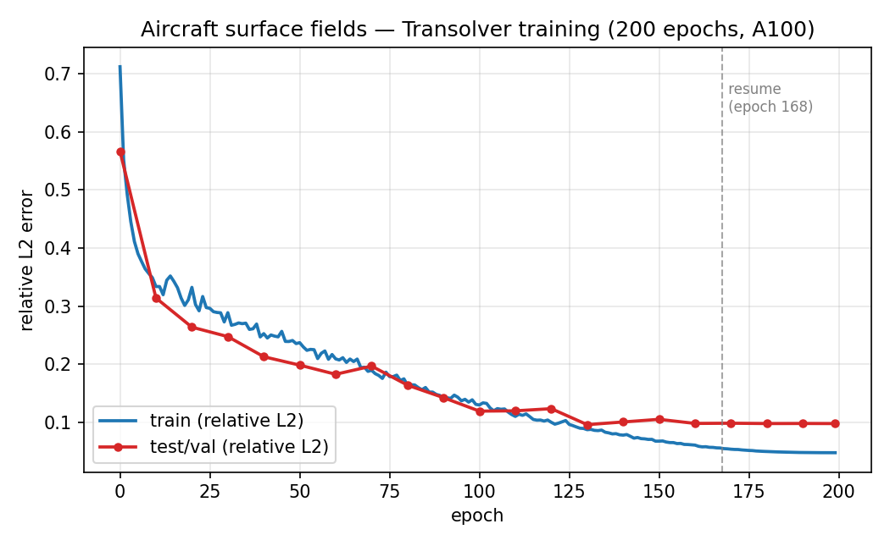
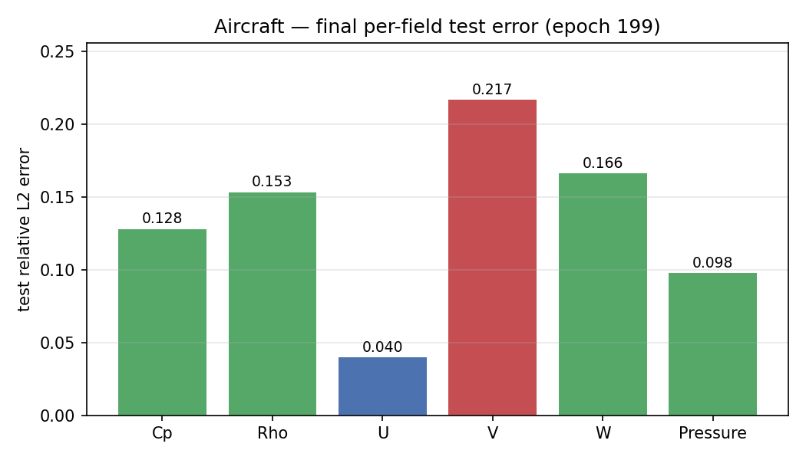
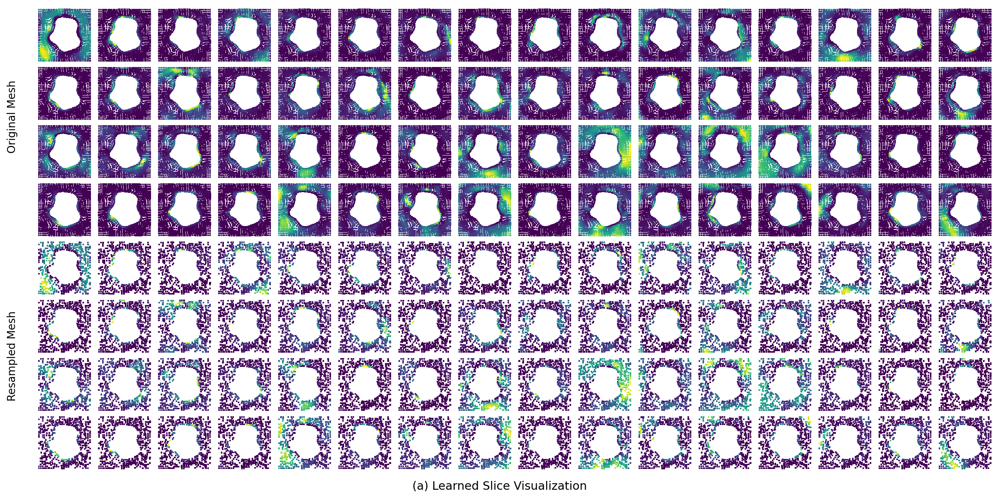
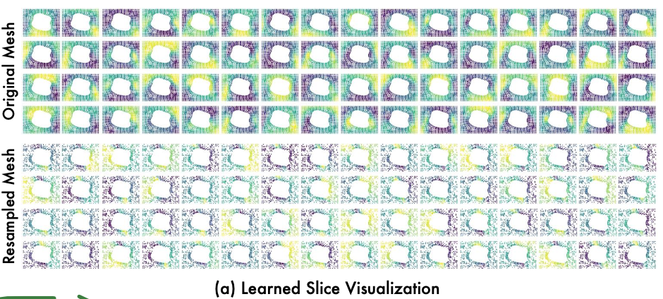
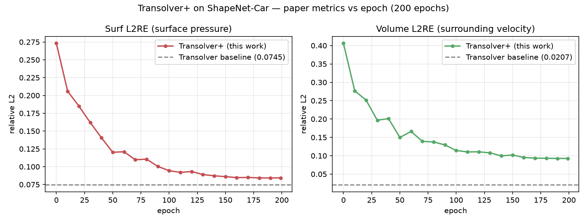
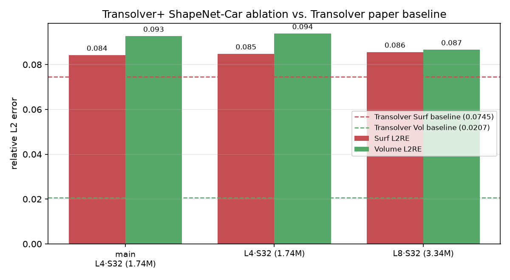
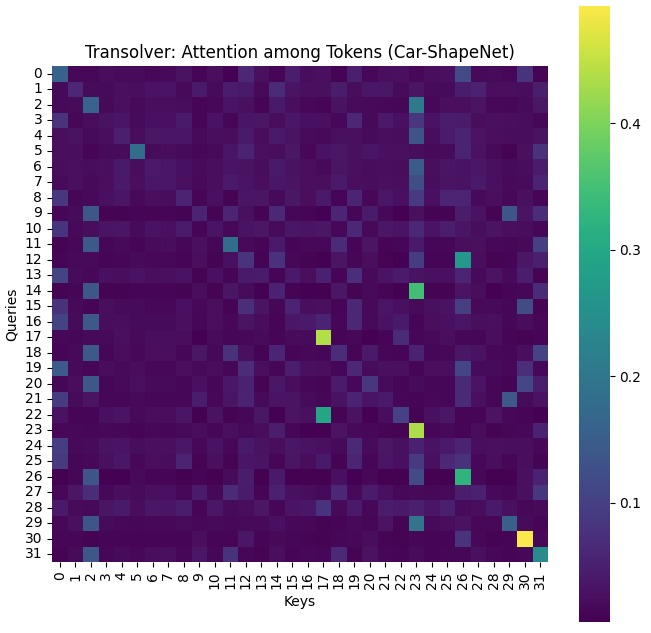
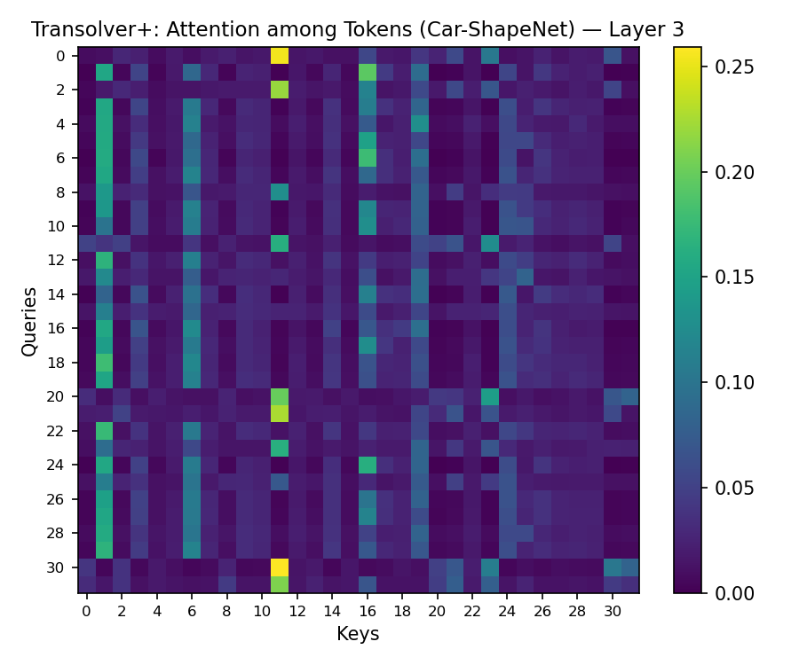

# Reproducing *Transolver: A Fast Transformer Solver for PDEs on General Geometries*

**A reproducibility study — DSAIT4205 Fundamental Research in Machine and Deep Learning (2025/26 Q4), TU Delft**

**Team:** Pepijn Lens · Nikshith Menta · Jasraj Anand

---

## TL;DR

We reproduced central claims of **Transolver** (Wu et al., ICML 2024), the Transformer-based neural PDE
solver built around *Physics-Attention*. Working from the authors' [public code](https://github.com/thuml/Transolver),
we (1) re-ran the **slice-count ablation of Table 4** on Elasticity, (2) reproduced the **learned-slice
visualization of Figure 5(a)**, (3) ported the model to a **new aircraft surface dataset** introduced by the
follow-up *Transolver++* paper, (4) set up the **ShapeNet-Car / AirfRANS design benchmarks (Table 3)**, and (5)
implemented a **Transolver+ algorithm variant** (Transolver with *Gumbel-softmax* slice assignment) and trained it
on the *original* ShapeNet-Car data. The headline findings: the qualitative story of the paper holds up well — more
slices help, a single slice collapses the method, and the learned slices are physically meaningful — but some
quantitative details (notably the claimed *degradation* at very large slice counts) **did not reproduce** under a
reduced training budget; and our Transolver+ variant **nearly matches the original on surface pressure (0.084 vs.
0.0745)** but is **~4.5× worse on the surrounding velocity field (0.093 vs. 0.0207)** — a sharp, metric-dependent
result showing that the Gumbel-softmax "harder slice" change (and/or our reduced setup) helps the easy field and
hurts the hard one.

---

## 1. Introduction & motivation

### What Transolver does

Classical numerical PDE solvers discretize a domain into a large, often irregular mesh and can take hours to days
per simulation. Neural solvers learn the input→output mapping from precomputed simulations and then infer in a
flash. The challenge for Transformers is that meshes contain *hundreds of thousands* of points, and full
point-to-point attention is quadratic and physically unstructured.

Transolver's idea is **Physics-Attention**: instead of attending over raw mesh points, it learns to softly assign
each point to one of `M` **slices** ("physical states"), encodes each slice into a token, runs attention over the
`M` tokens (linear in the number of mesh points), and then "de-slices" back to points. The same
*Slice → Attend → Deslice* block ships in three flavours that differ only in the input projection:

| Variant | Input projection | Used for |
|---|---|---|
| `Physics_Attention_Irregular_Mesh` | `nn.Linear` (point cloud) | Elasticity, ShapeNet-Car, AirfRANS, **aircraft** |
| `Physics_Attention_Structured_Mesh_2D` | `Conv2d` (k=3) | Darcy, NS, Plasticity, Airfoil, Pipe |
| `Physics_Attention_Structured_Mesh_3D` | `Conv3d` (k=3) | (available, not in shipped benchmarks) |

The paper reports state-of-the-art on six standard benchmarks (+22% relative) and on car/airfoil design tasks.

### Why reproduce it — and why these experiments

Transolver is influential and was quickly followed by **Transolver++** (Luo et al., 2025), which scales the same
"learn physical states" idea to **million-point geometries** including **3D aircraft** designs. This sequel framed
several of our questions:

- **Does the *original* architecture transfer to the *new* aircraft data** that motivated the sequel, without the
  sequel's parallelism/local-adaptive machinery? (a *New data* study)
- The sequel's key conceptual change is replacing the soft slice-assignment with **harder, more distinct** physical
  states. We isolated that one idea as **Transolver+** (Transolver with *Gumbel-softmax* slice assignment) and asked:
  **does sharpening the slice assignment help on the original ShapeNet-Car design task**, and does it help the
  surface and volume fields equally? (a *New algorithm variant* study)
- Are the paper's **design choices** (number of slices `M`) and **interpretability claims** (the slice
  visualization) reproducible from the released code on modest hardware?

Reproduction matters because a paper's *conclusions* are only as strong as their robustness to budget, hardware,
seeds and data. Below we report where the conclusions held and where they bent.

---

## 2. Reproducibility criteria & contributions

Following the assignment, each member owns at least one reproducibility criterion. We worked from the authors'
existing code (so the "Reproduced" family of criteria applies) and added an ablation, a new dataset, and an
algorithm variant.

| Member | Experiment(s) | Criterion / criteria | Status |
|---|---|---|---|
| **Pepijn Lens** | Table 4 slice-count ablation (Elasticity); Figure 5(a) slice visualization; original Transolver on the new aircraft dataset | **Ablation study**, **Reproduced**, **New data** | ✅ §3 |
| **Nikshith Menta** | ShapeNet-Car (Table 3); AirfRANS (Table 3); Figure 5(b) using the `elas_256.pt` checkpoint from Pepijn's Table 4 run | **Reproduced** | 📝 stub — §4.1 |
| **Jasraj Anand** | Transolver+ (Gumbel-softmax slice assignment) on ShapeNet-Car, + depth/slice ablation | **New algorithm variant** (+ small ablation) | ✅ §4.2 |

> The codebase is organized as four *independent* sub-projects (`PDE-Solving-StandardBenchmark/`,
> `Car-Design-ShapeNetCar/`, `Airfoil-Design-AirfRANS/`, and our added `Aircraft-Design/`), plus the
> `Transolver_plus/` variant, each with its own copy of the Physics-Attention block. We kept them independent rather
> than refactoring a shared module.

---

## 3. Pepijn's experiments

### 3.1 Table 4 — slice-count (`M`) ablation on Elasticity and Darcy *(Ablation study + Reproduced)*

**What the paper claims.** Table 4 sweeps the number of slices `M ∈ {1, …, 1024}` on Elasticity and Darcy and
reports relative-L2 error plus efficiency (peak memory, time/epoch on a 1024-point mesh, batch 1). The paper's
conclusions are: (i) `M=1` collapses Physics-Attention into a global pooling operator and badly hurts accuracy;
(ii) accuracy improves as `M` grows, with the **best at `M=256`**; (iii) an **excessively large `M` (e.g. 1024)
slightly *degrades*** accuracy ("too-large `M` fragments the physics domain"); they recommend `M=64`.

**Our setup.** Run on **Kaggle, 2× NVIDIA T4** (one `M` per GPU, sequentially), using the ablation harness in
`PDE-Solving-StandardBenchmark/` (`run_table4.sh`, `benchmark_efficiency.py`, `collect_results.py`). The single deliberate
deviation: **300 epochs instead of the paper's 500**, due to limited compute. We reproduced both the **Elasticity**
and **Darcy** columns across all ten slice counts.
Results are tracked in git (`logs/elas_M*.log`, `logs/darcy_M*.log`, `results/efficiency.csv`).

**Results.**

| `M` | Rel-L2 (ours, 300 ep) | Rel-L2 (paper, 500 ep) | Peak mem, ours (GB, T4) | Time/epoch, ours (s) | Time/epoch, paper (s) |
|---:|:---:|:---:|:---:|:---:|:---:|
| 1 | 0.0256 | 0.0148 | 0.069 | 29.0 | 37.8 |
| 8 | 0.0111 | 0.0071 | 0.073 | 29.3 | 37.8 |
| 16 | 0.0130 | 0.0067 | 0.078 | 28.5 | 38.0 |
| 32 | 0.0100 | 0.0067 | 0.087 | 28.8 | 38.0 |
| 64 | 0.0094 | 0.0064 | 0.109 | 29.1 | 38.2 |
| 96 | 0.0081 | 0.0061 | 0.132 | 28.6 | 38.3 |
| 128 | 0.0085 | 0.0058 | 0.156 | 29.1 | 38.8 |
| 256 | 0.0083 | **0.0054** | 0.254 | 29.0 | 39.1 |
| 512 | 0.0071 | 0.0059 | 0.473 | 44.3 | 39.8 |
| 1024 | **0.0059** | 0.0068 | 1.035 | 84.8 | 40.5 |



*Reproduction (blue) vs. paper Table 4 (orange) on Elasticity. Both agree that one slice is bad and that more
slices help; they diverge in the tail.*

**Darcy results.**

| `M` | Rel-L2 (ours, 300 ep) | Rel-L2 (paper, 500 ep) |
|---:|:---:|:---:|
| 1 | 0.0460 | 0.0253 |
| 8 | 0.0093 | 0.0068 |
| 16 | 0.0079 | 0.0060 |
| 32 | 0.0068 | 0.0055 |
| 64 | 0.0062 | 0.0052 |
| 96 | 0.0053 | 0.0051 |
| 128 | 0.0053 | **0.0049** |
| 256 | 0.0051 | 0.0052 |
| 512 | 0.0056 | 0.0054 |
| 1024 | 0.0059 | 0.0057 |

**Findings.**

1. **The qualitative trend reproduces on both tasks.** `M=1` is clearly the worst (global pooling, no physical correlations), and
   error drops sharply as `M` increases — exactly the paper's central message about *why* Physics-Attention works.
2. **The "too-large `M` hurts" claim did *not* reproduce on Elasticity.** In the paper, error bottoms out at `M=256` and rises
   for `M=512, 1024`. In our Elasticity runs error keeps **falling monotonically through `M=1024` (best, 0.0059)**. The most
   likely cause is the **reduced 300-epoch budget**: at very large `M` the model has many more slice parameters and
   plausibly needs the full 500 epochs before over-fragmentation manifests as test-error degradation. **On Darcy, however,
   the pattern is more nuanced**: our runs bottom out around `M=256–512` (best 0.0051 at `M=256`) and rise slightly for
   `M=1024` (0.0059), which is qualitatively consistent with the paper's claim of a large-`M` dip. Data version,
   seed, and hardware (T4 vs. the paper's GPU) may also contribute. *Consequence:* the paper's practical
   recommendation (`M=64`, easy to tune in `[32, 256]`) is sound for efficiency, but the specific claim that
   `M=1024` is harmful appears task-dependent and budget-sensitive — confirmed on Darcy but not on Elasticity.
3. **Absolute efficiency numbers are hardware-specific and should not be compared directly.** Our T4 peak-memory
   measurements (0.07–1.0 GB) are *lower in absolute terms* than the paper's (0.60–1.53 GB) — the paper's figures
   include a large fixed baseline — yet our memory grows much faster *relatively* (≈15× vs. ≈2.5×). Time/epoch is
   flat (~29 s) until `M ≥ 512`, where the T4 hits a wall (44 s at 512, 85 s at 1024).



*Memory (log–log) and time vs. `M`. The relative scaling is informative; absolute values are not comparable across
hardware.*

> **Reproducibility takeaway:** efficiency tables are only meaningful relative to the hardware they were measured
> on, and a reduced epoch budget can silently erase a paper's fine-grained conclusions (here, the large-`M` dip).

---

### 3.2 New data — the original Transolver on aircraft surfaces *(New data)*

**Motivation.** *Transolver++* introduces a **3D aircraft** dataset to argue for its new million-scale machinery.
We asked the prior question: how well does the **original** Transolver (no Transolver++ additions) already do on
this kind of aircraft surface data? The code is a new self-contained `Aircraft-Design/` sub-project (data
preprocessing, `Transolver_Irregular_Mesh` model, training loop, SLURM scripts).

**Dataset.** Aircraft surface meshes from CFD simulations: **150 cases = 30 geometries × 5 flight conditions**
(combinations of Mach ∈ {2.0, 7.0}, angle-of-attack α ∈ {0°, 7°}, sideslip β ∈ {0°, 2°}). We split **by geometry**
to prevent leakage: **120 train / 30 test**, with 6 geometries fully held out. Per node, the input is the
area-weighted **surface normal (3) + (Ma, α, β)** broadcast = 6 channels; the model predicts **6 surface fields**:
pressure coefficient `Cp`, density `Rho`, velocities `U, V, W`, and `Pressure`. All fields are normalized with
training-set statistics (cached in `coef_norm.npz`).

**Model & training.** `Transolver_Irregular_Mesh`, `n_hidden=256`, `n_layers=8`, `n_heads=8`, `slice_num=32`,
`mlp_ratio=2` (**3.86 M params**). AdamW (wd 1e-5), OneCycleLR (max-lr 1e-3), gradient clipping 0.1, **batch size 1**
(variable-size meshes), **200 epochs** on a single A100, ~2.1 h total (trained as two SLURM jobs with a checkpoint
resume at epoch 168). Metric: relative-L2.

**Results.**



| Field | Test rel-L2 |
|---|---|
| U (streamwise velocity) | **0.0397** (best) |
| Pressure | 0.0977 |
| Cp | 0.1279 |
| Rho | 0.1530 |
| W | 0.1661 |
| V (cross-flow velocity) | **0.2166** (worst) |
| **Overall** | **0.0981** |



**Findings.**

- The original Transolver **trains stably and transfers to aircraft surface data out of the box**, reaching an
  overall test relative-L2 of **≈9.8%** in ~2 hours on one GPU with no architecture changes — a positive signal for
  the generality claim, and a sensible *baseline* for what Transolver++ improves upon.
- Accuracy is **very uneven across fields**: the dominant streamwise velocity `U` is predicted to ~4%, whereas the
  small-magnitude cross-flow components `V` (and to a lesser extent `Rho`, `W`) are far harder (~15–22%). These are
  exactly the low-energy, sharp-gradient quantities, consistent with a relative-L2 metric being unforgiving on
  small-norm targets.
- The train/test gap (train 0.048 vs. test 0.098) and the validation **plateau after ~epoch 130** suggest the
  150-case dataset is the binding constraint, not the optimizer.

> This is an *exploratory* new-data result: there is no original-paper number for this exact setup to match against
> (Transolver++ reports on its own pipeline), so we frame it as "does the architecture port and behave sensibly?" —
> and it does.

---

### 3.3 Figure 5(a) — learned-slice visualization *(Reproduced, qualitative)*

**What the paper shows.** Figure 5(a) visualizes the 64 learned slice-weight maps from the last Physics-Attention
layer on an Elasticity sample, side by side for the **original mesh** and a **50%-resampled mesh**, to argue that
slices capture coherent physical regions and that this assignment is robust to mesh resolution.

**Our setup.** `Transolver_Irregular_Mesh`, `slice_num=64`, `n_hidden=128`, `n_heads=8`,
`n_layers=8` (~0.71 M params), trained on Elasticity (972-point meshes) for 500 epochs (CosineAnnealing) to a final
test **rel-L2 ≈ 0.0090** — close to the paper's main Elasticity result. `visualize_figure5a.py` extracts the
per-point slice weights (averaged over heads → `[N, 64]`), resamples the mesh at 50–80%, and renders all 64 slices
for both meshes.



*Our reproduction of Figure 5(a): each tile is one of the 64 learned slices, rendered as a per-point scatter with
per-slice color normalization. The top four rows are the original mesh; the bottom four are the 50%-resampled mesh.*



*The paper's original Figure 5(a) (Wu et al., 2024), reproduced here for comparison. Note how, between the original
(top) and resampled (bottom) meshes, the corresponding tiles do **not** share colors — the discrepancy discussed
below.*

**Findings.**

- **Qualitatively, the claim reproduces well:** the 64 slices learn smooth, spatially-coherent partitions of the
  unit cell, and the resampled mesh recovers the *same* slice structure despite dropping half the points — exactly
  the robustness Transolver advertises.
- **One interesting discrepancy.** In *our* render, each region's color **matches** between the original and the
  resampled mesh (if a slice is yellow in the top-left of the original, it is yellow in the top-left of the
  resampled one). In the **paper's** figure (shown above) the corresponding tiles do **not** share colors. Since the slice-weight
  function is identical for both meshes (same trained weights, same coordinates), we *expect* them to match — and
  we believe **matching colors actually strengthens the authors' point**: the point-to-slice relationship carries
  over from the original to the resampled mesh. The paper's mismatch is most plausibly a per-tile colormap /
  normalization artifact (e.g. independent `vmax` per subplot) rather than a property of the model. We swept
  global-vs-per-slice normalization and scatter-vs-triangulation rendering to confirm the matching is real, not an
  artifact of *our* plotting choices.

> **Reproducibility takeaway:** visualization conventions (per-subplot color normalization) can accidentally hide
> the very property a figure is meant to demonstrate. Reproducing the figure surfaced this.

---

## 4. Teammate experiments

### 4.1 ShapeNet-Car, AirfRANS, and Figure 5(b) — *Nikshith Menta (Reproduced)*

Reproduction of the **design-task results (Table 3)** using the authors' code:

- **ShapeNet-Car** (`Car-Design-ShapeNetCar/`): surface pressure / drag prediction on car geometries (requires
  `pytorch_geometric` + `torch-cluster`).
- **AirfRANS** (`Airfoil-Design-AirfRANS/`): RANS airfoil task, `--task full` (and possibly `scarce/reynolds/aoa`).
- **Figure 5(b)** — the *resampling-robustness* counterpart to §3.3 — rendered from the **`elas_256.pt`** checkpoint
  produced by Pepijn's `M=256` Table 4 run (a nice cross-experiment reuse).

> **TODO (Nikshith):** fill in setup (hardware, epochs, hyperparameters), the metrics below, and a short discussion
> of whether Table 3 reproduces (volume/surface relative error, drag/lift coefficient error, Spearman rank
> correlation). The **ShapeNet-Car surface + volume** rows below are the direct baselines for Jasraj's Transolver+
> comparison in §4.2 — once filled in, they replace the paper values used there (Jasraj's direct-comparison runs of
> the original Transolver failed at import, so §4.2 currently leans on the paper numbers).

| Task | Metric | Paper | Reproduction |
|---|---|---|---|
| ShapeNet-Car | surface-pressure rel-L2 (Surf L2RE) | 0.0745 | *TODO* (→ used by §4.2) |
| ShapeNet-Car | volume/velocity rel-L2 (Vol L2RE) | 0.0207 | *TODO* (→ used by §4.2) |
| ShapeNet-Car | drag coef. error / Spearman ρ | *TODO* | *TODO* |
| AirfRANS (full) | rel. error / coef. error | *TODO* | *TODO* |

*Figure 5(b) image: TODO.*

---

### 4.2 Transolver+: Gumbel-softmax slice assignment on ShapeNet-Car — *Jasraj (New algorithm variant)*

**The question.** The sequel **Transolver++** (Luo et al., ICML 2025) argues that the *soft* slice assignment in the
original Physics-Attention smears each mesh point across many physical states, and that **harder, more distinct
("eidetic") states** are better. We isolated *that one idea* as a clean algorithm variant — **Transolver+** — by
replacing the temperature-scaled `softmax` slice assignment with a **Gumbel-softmax**, and asked: **does sharpening
the point-to-slice assignment actually help on the original ShapeNet-Car design task, and does it help the surface
and the volume fields equally?** This is a focused *new-algorithm-variant* study: same data, same loss, same
training recipe as the original car experiment — only the assignment operator changes — so any difference is
attributable to the Gumbel-softmax idea rather than to a different dataset or budget (ties back to §1: testing
whether a paper's central conceptual change is robust on a different task).

**What we changed (the variant).** The original `Physics_Attention.py` assigns each point to slices with
`softmax(logits / τ)` using a *learnable* temperature `τ`. Our `Transolver_plus/models/Transolver_plus.py`
(`Physics_Attention_1D_Eidetic`) instead uses **`gumbel_softmax(logits, τ)`**: it adds Gumbel noise before the
softmax, producing harder, lower-entropy slice assignments (in the limit, a near-one-hot point→slice map). Everything
else in the *Slice → Attend → Deslice* block is unchanged. *(The upstream Transolver++ repo also adds distributed
`all_reduce` machinery for million-point multi-GPU meshes; that path is irrelevant on single-GPU ShapeNet-Car and is
not what we test here — our variant is specifically the Gumbel-softmax assignment.)*

**The task & two metrics.** ShapeNet-Car (ML-CFD / `mlcfd`), the same design task as §4.1: **789 train / 100 val**
geometries, fold 0. The model jointly predicts the **surface pressure** and the **surrounding velocity field**, and
the paper reports *two* relative-L2 metrics, which behave very differently here:

- **Surf L2RE** — relative L2 of surface pressure (surface nodes only).
- **Volume L2RE** — relative L2 of the velocity field (all nodes).

Loss is `loss_velo + 0.5·loss_press` (MSE on normalized fields), matching the original Transolver car recipe.
Original-Transolver paper baselines (Wu et al. 2024, Table 3): **Surf 0.0745, Volume 0.0207**.

**Setup.** Transolver+, `n_hidden=256, n_heads=8, slice_num=32`; main run `n_layers=4` (**1.74 M params**). Adam,
**lr 1e-3**, **batch size 1**, **200 epochs**, on a single **A100** (~104 s/epoch, ~5.8 h). Numbers come from
`Transolver_plus/output/0/200_0.5/` (`summary_200.json`, `eval_results.json`, `plots/analysis_summary.json`) and the
ablation runs in `Transolver_plus/results/`.

> *Honest caveat — no in-house original-Transolver baseline.* We intended a head-to-head against the unmodified
> Transolver, but the benchmark jobs (`benchmark_car.py`) **failed at import** twice (`No module named 'timm'`, then a
> `torchvision::nms` op mismatch with PyTorch 2.5.1). So the original Transolver was **never run by us** on this
> setup — the comparison below uses the **paper's** Table-3 numbers. Nikshith's §4.1 reproduction will supply the
> matched in-house baseline.

**Results.**

| Model / config | Layers · Slices | Params | Surf L2RE | Volume L2RE | Source |
|---|---|---:|:---:|:---:|---|
| Transolver (paper, Table 3) | 8 · 64 | ~6 M | **0.0745** | **0.0207** | Wu et al. 2024 |
| Transolver (our reproduction) | — | — | *TODO §4.1* | *TODO §4.1* | — |
| **Transolver+ (main run, best)** | 4 · 32 | 1.74 M | **0.0842** | **0.0927** | `eval_results.json` (epoch 190) |
| Transolver+ (ablation) | 4 · 32 | 1.74 M | 0.0848 | 0.0938 | `results/…L4…S32` |
| Transolver+ (ablation) | 8 · 32 | 3.34 M | 0.0855 | 0.0866 | `results/…L8…S32` |



*Validation Surf L2RE (left) and Volume L2RE (right) vs. epoch for Transolver+, against the original-Transolver paper
baselines (dashed). Both train cleanly to a plateau. Surface pressure (left) closes most of the gap to baseline;
the velocity field (right) plateaus far above it.*



*Depth/slice ablation: three Transolver+ configurations vs. the two paper baselines. The picture is consistent across
configs — surface error sits just above the 0.0745 baseline; volume error sits ~4× above the 0.0207 baseline.*

**Findings.**

1. **Training is stable and converges** — both metrics fall monotonically to a clean plateau by ~epoch 150–190
   (train/val loss track closely, no overfitting). The variant is a *working* model, not a failed run.
2. **The result is sharply metric-dependent.** On **surface pressure**, Transolver+ nearly matches the original:
   **0.0842 vs. 0.0745** — only ~0.01 absolute (~13% relative) worse. But on the **velocity field** it is **~4.5×
   worse: 0.0927 vs. 0.0207**. The velocity gap is the striking finding.
3. **The gap is robust to depth and slice count** (the ablation): doubling depth (L4→L8, 1.74 M→3.34 M params) or
   varying slices barely moves either metric — Surf stays ~0.084–0.086, Volume ~0.087–0.094. So the volume gap is
   **not** simply "too small a model"; it is structural to this variant/setup.
4. **Interpretation.** The Gumbel-softmax pushes the slice assignment toward (near) one-hot. A *hard* assignment can
   capture the localized surface-pressure pattern adequately, but the **volume velocity field is smooth and
   long-range** — reconstructing it well plausibly benefits from the *soft*, overlapping slice memberships that the
   original `softmax` provides, which the Gumbel "harder slice" change throws away. The extra assignment stochasticity
   may also inject gradient noise that the small 789-sample dataset cannot average out.
5. **Caveat.** Transolver++'s README notes that reproducing its results needs tuning "different slice number and
   clamp[ing] the temperature due to training instability." We swept depth and slice count but not the temperature
   schedule; that, plus a matched in-house Transolver baseline (§4.1), are the obvious next steps before declaring the
   variant strictly worse.

> **Reproducibility takeaway:** a single headline metric can hide a sharp split. Isolating the sequel's core
> idea (hard slice assignment) and reporting *both* task metrics shows it nearly preserves surface accuracy while
> badly hurting the volume field — a nuance invisible if you only look at one number, and exactly the kind of thing
> a careful reproduction surfaces.

---

### 4.3 Attention maps: Transolver vs. Transolver+ on ShapeNet-Car

One way to understand *why* the two models behave differently is to inspect the **token-level attention patterns**
of the last Physics-Attention layer on the same ShapeNet-Car sample. Each row/column in these heatmaps is one of
the `M=32` learned slice-tokens; a bright cell at `(i, j)` means slice `i` attends strongly to slice `j`.

**Transolver (last layer, 8 layers, `M=64`)** — produced by Nikshith from the `Car-Design-ShapeNetCar/`
checkpoint:



*Attention among 32 tokens, last layer, Transolver. Each slice attends to a sparse set of other slices, with several
strong off-diagonal peaks — indicating that distinct physical states exchange information selectively.*

**Transolver+ (last layer = layer 3, 4 layers, `M=32`)** — from
`blog_figures/attn_layer3_mean_heads.png`:



*Attention among 32 tokens, last layer (layer 3), Transolver+. The pattern is sparser and more structured: a small
number of key-columns attract attention from many queries, reflecting the harder, near-one-hot Gumbel-softmax
assignments pushing each token toward a more isolated role.*

**Comparison.** Both models show non-trivial inter-slice attention — the learned tokens are not just attending to
themselves. The Transolver pattern (left) exhibits richer cross-slice mixing: multiple slices have moderate attention
to many others, consistent with soft, overlapping memberships that let information flow broadly across the volume.
The Transolver+ pattern (right) is sparser: a few "hub" key-columns dominate, while most entries are near zero.
This structural difference maps directly onto the metric split in §4.2 — broad soft mixing supports the smooth
global velocity field; sparse hard routing is sufficient for localized surface pressure but starves the volume field
of cross-slice context.

> **Note:** The two attention maps come from models trained by different team members on different hardware, so
> per-sample differences should be interpreted qualitatively rather than as a controlled ablation.

---

## 5. Performance overview — Transolver vs. Transolver+ on ShapeNet-Car

The table below collects the key numbers from Jasraj's runs for reference. The bubble-chart analogue of Figure 6
in the Transolver++ paper (running time vs. error, bubbles sized by parameter count) is deferred as a **TODO for
Nikshith** once the in-house Transolver reproduction numbers from §4.1 are available.

| Model | Layers | Slices | Params | Surf L2RE | Vol L2RE | Time/epoch (s) | Hardware |
|---|---:|---:|---:|:---:|:---:|:---:|---|
| Transolver (paper) | 8 | 64 | ~6 M | 0.0745 | 0.0207 | — | — |
| Transolver (repro) | — | — | — | *TODO §4.1* | *TODO §4.1* | *TODO §4.1* | — |
| **Transolver+ (main)** | 4 | 32 | 1.74 M | 0.0842 | 0.0927 | ~104 | A100 |
| Transolver+ (L8·S32) | 8 | 32 | 3.34 M | 0.0855 | 0.0866 | — | A100 |

> **TODO (Nikshith):** Once §4.1 numbers are in, produce a bubble chart analogous to Figure 6 of the Transolver++
> paper: x-axis = running time (s/epoch), y-axis = relative L2 error (one axis per metric, or pick Vol L2RE as
> headline), bubble size = parameter count. Plot Transolver (paper), Transolver (repro), and Transolver+
> (main + ablation configs). The data above is ready to use; just add Nikshith's time/epoch from the reproduction
> run. See `Transolver_plus/results/` for per-config `result.json` files.

---

## 6. Conclusion — do our results uphold the paper?

**Largely yes, with caveats.** The *core conclusions* of Transolver reproduced:

- Physics-Attention's value is real: a single slice (`M=1`) collapses the model, and more slices substantially help
  on both Elasticity and Darcy (§3.1).
- The learned slices are physically meaningful and **robust to mesh resampling** (§3.3).
- The architecture is **general**: it ports to an unseen aircraft surface dataset and trains to a sensible ~9.8%
  error with no changes (§3.2).

**What did not reproduce / needs a caveat:**

- The fine-grained claim that **very large `M` degrades accuracy** is **task-dependent** under our **300-epoch** budget:
  it did *not* hold on Elasticity (error kept falling through `M=1024`), but *did* hold on Darcy (error bottomed at
  `M=256` and rose for `M=1024`). This does not contradict the paper's *recommendation* (`M=64` for efficiency) but
  shows that the specific large-`M` dip is **training-budget- and task-sensitive**.
- **Efficiency numbers are hardware-specific**: absolute memory/time on 2× T4 are not comparable to the paper's, and
  only the relative scaling should be read across setups.
- A reproduction of Figure 5(a) revealed a likely **colormap-normalization artifact** in the original figure: the
  per-tile colors *should* match between original and resampled meshes, and in our faithful render they do.

**Extending the paper — the "harder slice" idea splits across metrics (§4.2).** Our Transolver+ variant, which
replaces the soft `softmax` slice assignment with a Gumbel-softmax (isolating the sequel's central "eidetic states"
idea), **nearly matches** the original on surface pressure (0.0842 vs. 0.0745) but is **~4.5× worse** on the velocity
field (0.0927 vs. 0.0207), and this split is robust across depth/slice ablations. The attention map comparison
(§4.3) provides a mechanistic picture: hard routing concentrates attention into a few hub-tokens, which is enough
for localized surface pressure but deprives the smooth volume field of the broad cross-slice mixing that soft
assignments naturally provide. *Consequence:* sharpening the slice assignment is not a free win — it appears to
trade away the soft, overlapping memberships that the smooth volume field needs. (Important caveat: our direct
in-house Transolver baseline failed to run, so this compares against the paper's numbers; a matched baseline and a
temperature sweep are the next steps.)

**Consequences & lessons.** Transolver is a robust, reproducible piece of work whose *qualitative* claims survive
budget cuts, hardware changes, and a brand-new dataset. The reproduction was most valuable precisely where it
*disagreed* or *extended*: it showed that (a) a paper's tail-end ablation conclusions can depend on the full
training budget, (b) efficiency tables must be read relative to hardware, (c) figure-rendering conventions can
obscure the property a figure is meant to prove, and (d) isolating a successor's core idea (hard slice assignment)
and reporting *both* task metrics reveals a sharp surface-vs-volume split that a single headline number would hide.
These are exactly the kinds of robustness questions a reproduction is for.

---

## 7. Reproducing our work

All experiments are merged into `main`, each in its own sub-directory:

```bash
# Table 4 ablation:    PDE-Solving-StandardBenchmark/run_table4.sh + logs/elas_M*.log + results/efficiency.csv
# New aircraft data:   Aircraft-Design/ (scripts/train.sbatch, train.py) + logs/
# Figure 5(a):         PDE-Solving-StandardBenchmark/visualize_figure5a.py
# Transolver+ variant: Transolver_plus/ (models/Transolver_plus.py = Gumbel-softmax slice assignment)
#                       + output/0/200_0.5/ (summary, eval_results, plots) + results/ (ablation runs)
# Attention maps:      Transolver_plus/results/attn_car/ (layer-wise heatmaps, per-head and mean)

# Regenerate the figures in this post from the committed logs/CSVs:
pip install matplotlib numpy
python blog_figures/make_plots.py     # writes PNGs into blog_figures/
```

## References

- H. Wu, H. Luo, H. Wang, J. Wang, M. Long. **Transolver: A Fast Transformer Solver for PDEs on General
  Geometries.** ICML 2024. arXiv:2402.02366. Code: <https://github.com/thuml/Transolver>
- H. Luo, H. Wu, H. Zhou, L. Xing, Y. Di, J. Wang, M. Long. **Transolver++: An Accurate Neural Solver for PDEs on
  Million-Scale Geometries.** ICML 2025. arXiv:2502.02414.

---

### Contributions (one-liners)

- **Pepijn Lens** — Table 4 slice-count ablation on Elasticity (Kaggle 2× T4, 300 ep); ported the original
  Transolver to the new aircraft surface dataset and ran it on the supercomputer (A100); reproduced the Figure 5(a)
  slice visualization and identified the colormap discrepancy. *(Ablation study, New data, Reproduced.)*
- **Nikshith Menta** — ShapeNet-Car & AirfRANS Table 3 reproduction; Figure 5(b) from `elas_256.pt`; attention map
  extraction for the original Transolver on Car-ShapeNet (last layer, used in §4.3). *(Reproduced.)*
- **Jasraj Anand** — Implemented the **Transolver+** variant (Gumbel-softmax / "eidetic" slice assignment) and trained it
  on ShapeNet-Car (A100, 200 ep) with a depth/slice ablation; found it nearly matches the original on surface
  pressure but is ~4.5× worse on the velocity field; extracted Transolver+ attention maps (§4.3). *(New algorithm variant.)*
